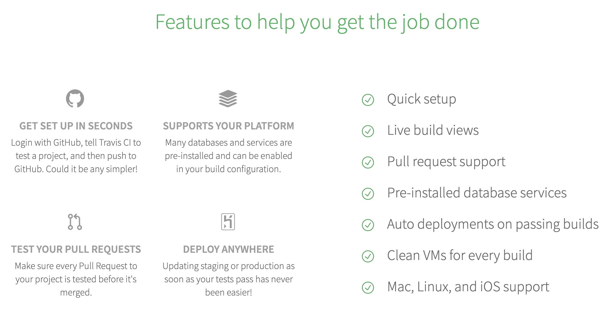

# Các bước để setup một base project từ đầu

## 1. Tạo project từ Xcode

## 2. Xác định mô hình hoặc template nếu có.

- Chúng ta cần xác định được nên chọn loại architect pattern nào dựa vào một vài tiêu chí sau đây:

	Sự nhanh nhẹn (agility)  ✅
  
   Dễ dàng phát triển (easy for development) ✅
  
   Kiểm thử (testability) ✅
  
   Hiệu suất (performance) ✅
  
   Khả năng mở rộng (scalability) ✅

   Tái sử dụng mã (code reusable) ✅

 Một vài mẫu có sẵn như MVC, MVVM, Viper, Redux,...

**P/s: Chúng ta cần tìm hiểu và phân biệt được các khái niệm về `architect style`, `architect pattern` và `design pattern`.**


- Template là một mẫu thiết kế đã được layout sẵn các bố cục.
Một vài công cụ để tạo template trong iOS như: Xcode template, [Cookiecutter](https://cookiecutter.readthedocs.io/en/1.7.2/README.html), [Xcodegen](https://github.com/yonaskolb/XcodeGen),...

## 3. Setup các Package Manager(SPM, Cocoapods, Carthage)

## 4. Cấu trúc lại các folder trong project.

- Group lại các file có cùng chức năng hoặc hỗ trợ nhau để dễ dàng quản lí.

- Đặt tên ngắn gọn, khái quát lên được tính năng


## 5. Cấu hình các môi trường cho dự án. (Dev, STG, PRO)

## 6. Define các key, text và color

- Cần xác định được nên lưu vị trí các key ở đâu, mức độ quan trọng và ảnh hưởng của mỗi key.
	- Keychain

	- Xconfig
	
	- UserDefault (Bad)


- [Color asset](https://viblo.asia/p/color-set-xu-ly-mau-sac-trong-xcode-9-1VgZvN21ZAw)

## 7. Config swiftlint, fastlane, deploygate cho project

### SwiftLint

Tích hợp SwiftLint vào project để nhận được các warning và error hiển thị trong trình điều hướng vấn đề.

Chúng ta có thể sắp xếp thứ biên dịch cho swiftlint trước `Compile Sources`, nhưng mà điều này có thể khiến cho swiftlint chạy không chính xác.


```
"${PODS_ROOT}/SwiftLint/swiftlint"
```

Ngoài ra ta có thể chạy thủ công bằng cách sử dụng fastlane

```
  # 1. Swift-lint
  desc "Does a static analysis of the project. Configure the options in .swiftlint.yml"
  lane :dev_lint do
   	swiftlint(
		mode: :lint,
		executable: "Pods/SwiftLint/swiftlint",
		reporter: "html",
		output_file: "fastlane/swiftlint-results.html",
		config_file: '.swiftlint.yml',
		ignore_exit_status: true
	)
  end
```

Thỉnh thoảng sẽ có những cái ngoại lệ mà ta không muốn swiftlint bắt thì swiftlint vẫn cho ta xủ lý linh hoạt để giải quyết vấn đề này.

```
// swiftlint:disable all 
// swiftlint:enable all
// swiftlint:disable:next force_cast
```

### Fastlane

#### 1. Cài đặt fastlane

Thêm nội dung vào file gemfile

```
source "https://rubygems.org"

gem "fastlane"
```

sau đó chạy `bundle update`, trong trường hợp chạy CI thì `bundle install` ta sẽ chạy lệnh này.

#### 2. Thiết lập fastlane và deploygate

`fastlane init`

```
  WORKSPACE = 'AppProject.xcworkspace'

  TARGET_NAME = "TargetName"
  SCHEME_DEV = 'SchemeName-DEV'
  CONFIGURATION_DEV = 'Debug-Dev'
  BUNDLE_ID_DEV = 'com.ios.develop'
  PROVISIONING_DEV = 'ProvisioningDEV'

  #DEPLOYGATE
  DEPLOYGATE_API_KEY = 'API_Key'
  DEPLOYGATE_USER = "username"


  # Deploy to Deploygate
  desc "Dev: Deploy "
  lane :dev_deploy do
    make_build_folder
    build_app_with(
      scheme: SCHEME_DEV,
      configuration: CONFIGURATION_DEV,
      bundle: BUNDLE_ID_DEV,
      provisioning: PROVISIONING_DEV,
      exportmethod: "development"
    )
    create_release_notes(format: 'Dev: %h %s AT')
    upload_deploygate
  end
  

  # Build app with options
  desc "Build app with options"
  private_lane :build_app_with do |options|
    @export_method = "enterprise"
    if (!"#{options[:exportmethod]}".to_s.empty?)
     @export_method = "#{options[:exportmethod]}"
    end
    sh "echo #{@export_method}"
    build_app(
      scheme: "#{options[:scheme]}",
      configuration: "#{options[:configuration]}",
      clean: true,
      output_name: "PJMusic.ipa",
      include_bitcode: false,
      skip_profile_detection: true,
      export_method: "#{@export_method}",
      export_options: {
        provisioningProfiles: { "#{options[:bundle]}": "#{options[:provisioning]}" }
      }
    )
  end
  

  # Define private functions
  desc "Make `build` Folder"
  private_lane :make_build_folder do
    sh "rm -rf ../build"
    sh "mkdir -p ../build"
  end


  # Upload to Deploygate
  desc "Upload to DeployGate"
  private_lane :upload_deploygate do
    File.open('./release_notes.txt').each do |line|
        @releasenote = line
        break
    end
    deploygate(
      api_token: DEPLOYGATE_API_KEY,
      user: DEPLOYGATE_USER,
      ipa: lane_context[SharedValues::IPA_OUTPUT_PATH],
      message: "#{@releasenote}"
    )
  end
  

  # Create release notes
  desc "Create release notes"
  private_lane :create_release_notes do |options|
    sh "git log -1 --pretty=tformat:\"#{options[:format]}\" > release_notes.txt"
  end
```

## 8. Thiết lập auto deploy TravisCI


### 8.1 Features


### 8.2 Workflow

Branch build flow


Pull request build flow


**So sánh**

|               | CircleCI          | TravisCI              |  Jenkins             |
|-|-|-|-|
| Supported OS  | Linux or MacOS    | Linux, MacOS, Windows | All (no limitations) |
| Repo          | Github, Bitbucket | Github                | All                  |
| Configuration | yml file          | yml file              | jenkins file         |


[Guide detail](https://fxstudio.dev/cau-hinh-travis-ci-cho-ios-project-tren-github/)

## 9. Bot auto review

Có rất nhiều loại bot

- Bot giới thiệu
- Bot sửa chính tả
- Bot quản lí issue & pr
- Bot giúp improve code

[Tham khảo ở đây](https://livablesoftware.com/best-bots-software-development/)